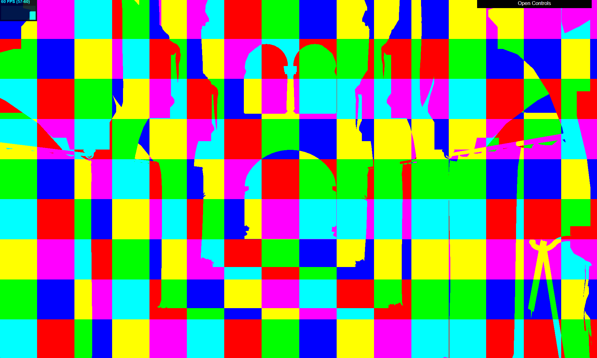
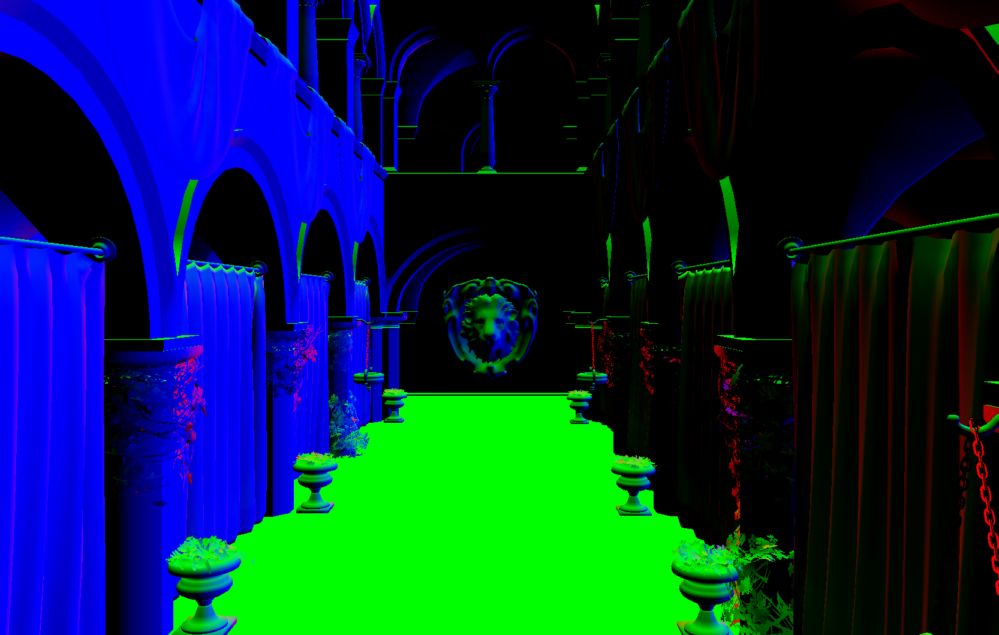
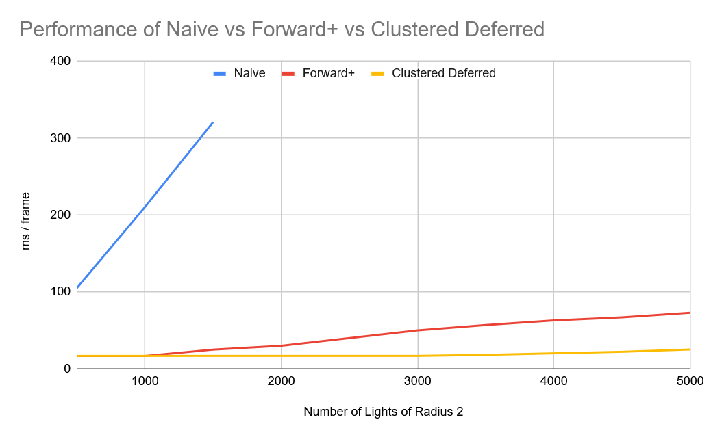

WebGL Forward+ and Clustered Deferred Shading
======================

**University of Pennsylvania, CIS 565: GPU Programming and Architecture, Project 4**

* Raymond Feng
  * [LinkedIn](https://www.linkedin.com/in/raymond-ma-feng/), [personal website](https://www.rfeng.dev/)
* Tested on: Windows 11, i9-9900KF @ 3.60GHz 32GB, NVIDIA GeForce RTX 2070 SUPER (Personal Computer)

## 

### Demo Video/GIF
https://github.com/user-attachments/assets/cedc7955-0bec-4fe9-93d4-d44dbf8a5e98

## Overview
In this project, I implemented naive forward rendering, forward+ rendering using clusters, and deferred rendering using WebGPU. Below, I'll also be explaining a little about each method and comparing their performances. 

### Naive Forward Rendering
In naive forward rendering, the fragment shader iterates through *every single* light in the scene and calculates its contribution to the pixel color. The light contribution is combined with the base albedo sampled from the texture.

With large amounts of lights, this can get very expensive. We want a way to cull lights that are too far away from the pixel to have any contribution.

### Forward+ Rendering
Forward+ rendering improves on the naive method by splitting the scene into view-space **clusters**. In world space, these are frustum-shaped bounding boxes. 

Each **cluster** stores the minimum and maximum view-space coordinate of its axis-aligned bounding box, the number of lights contained within that box, and an array of light indices. This array is a representation of each light that affects the box. 
- It's important to note that when slicing the scene along the z-axis, we want to use logarithmic rather than linear slices. This makes slices further away from the camera thicker as we want to account for the lack of space they take up on the screen.

To compute the final light contribution, we only iterate through the lights stored within that cluster instead of all lights in the scene, improving performance drastically.

| Z-Slices     | All Clusters      |
| ------------- | ------------- |
|  |  |

### Clustered Deferred Rendering
In clustered deferred rendering, we combine the functionality of clusters with a second render pass that stores a geometry buffer. Rather than compute the final color all at once, in one fragment shader, we write the values of a pixel's position, base color, and normal into a texture. 

| Position     | Base Color      | Normals |
| ------------- | ------------- | ------------- |
|  |  |  |

Then, we run a full-screen render pass to read from the texture, and compute lighting contribution using the clustering method.

## Performance analysis
For consistency, I tested on a canvas with resolution 1920 x 1080. Additionally, all lights have radius 2. I did not test naive rendering beyond 1,500 lights as it was becoming inconveniently slow for my browser to run.

Judging from the data collected, Forward+ and Clustered Deferred  seem to work equally fast until about 1,500 lights are introduced into the scene. From that point, we see that the speed it takes to render a frame with Forward+ slowly begins to increase, while the speed of Clustered Deferred rendering remains relatively consistent. **Overall, clustered deferred rendering is faster in all instances**. 

While clustered deferred rendering is faster, it also requires setting up a second render pass as well as saving textures in memory. The textures allow the renderer to calculate on a per-pixel basis instead of on a per-fragment basis, meaning that we avoid calculating fragments that are not seen by the camera. 

Very nice!

### Overall thoughts
Very much enjoyed this assignment. Deferred rendering my beloved

### Credits

- [Vite](https://vitejs.dev/)
- [loaders.gl](https://loaders.gl/)
- [dat.GUI](https://github.com/dataarts/dat.gui)
- [stats.js](https://github.com/mrdoob/stats.js)
- [wgpu-matrix](https://github.com/greggman/wgpu-matrix)
